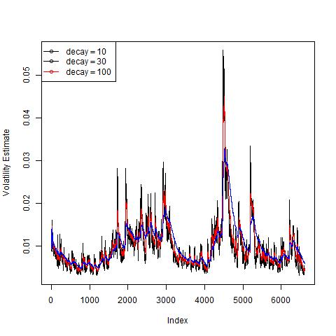

```{r setup, include=FALSE}
knitr::opts_chunk$set(echo = TRUE, eval = FALSE)
```
##Data Analysis Available
This report and accompaning analysis files are available at https://github.com/llh1000/Assignment11

##Standard and Poor's 500 Index
The Standard and Poors 500 Index (SNP500) is widely used a benchmark for the United States stock market.  Analyzing patterns and trends in this index can offer insight into the US stock market and national economy. We will examine the volatility of the SNP500 using three decay factors.

##Volatility Analysis and Computations
The data for the SNP 500 was obtained by getting the historical quotes beginning 1/2/1991 through 3/27/2017.  The returns were computed using logged data and the volatility was calculated using those results.  For the volatility estimates we have selected three different decay factors including 10, 30, and 100.  

```{r,code=readLines("SNP500LH.R")}
```

##Volitility Estimates
The plot below shows the three volatility estimates graphically.

